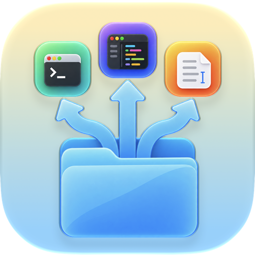

# FinderLauncher



FinderLauncher is a native macOS menu bar app with a Finder Sync extension. It adds configurable Finder actions for opening items in other apps, creating a text file in the current folder, and copying paths.

## Features

- Open selected files or folders in configured applications.
- Create a uniquely named `New Text File.txt` in the current folder.
- Hold Option while opening a Finder context menu to show **Copy Path**. Multiple selected paths are copied one per line.
- Manage applications, menu bar visibility, and launch at login from FinderLauncher settings.

## Requirements

- macOS 27 or later.
- Xcode 27 or later.
- An Apple Developer team and a registered App Group to sign and enable the Finder extension.

## Build

Open `FinderLauncher.xcodeproj`, select the `FinderLauncher` scheme, and build. For an unsigned command-line build:

```sh
xcodebuild -project FinderLauncher.xcodeproj \
  -scheme FinderLauncher \
  -destination 'platform=macOS,arch=arm64' \
  CODE_SIGNING_ALLOWED=NO build
```

Run the target resolver tests with:

```sh
xcodebuild -project FinderLauncher.xcodeproj \
  -scheme FinderLauncher \
  -destination 'platform=macOS,arch=arm64' \
  CODE_SIGNING_ALLOWED=NO test
```

## Signing and enabling the Finder extension

The project does not select a developer team. To sign it for your account, choose your team for the app and extension targets in Xcode. Replace the App Group identifier in both targets' `.entitlements` files and in `FinderLauncherShared/SharedConfigurationStore.swift` with an App Group registered to that team. The app and extension must use the same identifier. Choose bundle identifiers that are available to your team if the defaults conflict.

Build and launch FinderLauncher, open its settings, then use **Open Finder Extensions Settings** to enable the extension. macOS may also require approval for launch at login under **System Settings → General → Login Items**.

## Project layout

- `FinderLauncherApp/` — menu bar app and settings.
- `FinderLauncherFinderExtension/` — Finder context menu actions.
- `FinderLauncherShared/` — shared application configuration and Finder target handling.
- `FinderLauncherTests/` — target resolver tests.

## Status

This repository contains source code and does not include a signed or notarized release package. Finder extension enablement and context menu behavior should be validated on the target macOS installation before distributing a build.

## License

Licensed under the MIT License. See [LICENSE](LICENSE).
